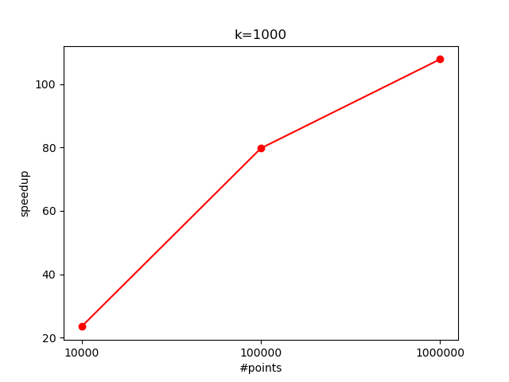

This project implements K-Means clustering using CUDA for parallelization, achieving significant speedup over the sequential version.

🚀 Speedup: Up to +100x faster for large datasets!



Read the full write-up [here](https://www.luigicennini.it/projects/cuda-kmeans/).


# Usage
Build code with
```cpp
make K=5
```

This will generate 6 files inside `build` directory: `kmeansSequential`, `kmeansCuda`, `kmeansCudaV2`, `kmeansCudaV3`, `kmeansCudaV3` and   `kmeansParallel` (openmp implementation).

You can try them passing the dataset and starting centroids csv files as an argument:
Example:

```cpp
./build/kmeansSequential datasetUtils/generatedDatasets/1000_5.csv datasetUtils/generatedDatasets/1000_5_centroids.csv
```


The output will be the elapsed time.

*Note: if you don't pass K as an argument to the makefile, it will assume K=5*

## Display final centroids
To display final centroids build with `PRINT_FINAL_CENTROIDS` flag enabled:

```cpp
make PRINT_FINAL_CENTROIDS=1
```

## Export points to csv
To enable export of the end result (\*) (as csv) at the end of execution, build with `EXPORT_FINAL_RESULT` flag enabled:
```cpp
make PRINT_FINAL_CENTROIDS=1
```

(\*) The csv file will have the following form
```cpp
point0_x, point0_y, point0_cluster
point1_x, point1_y, point1_cluster
...
```
You can view the result using the `visualize_result.py` file inside `datasetUtils` directory.


## Generate new dataset
You can generate new datasets running the `create_dataset.py` file inside `datasetUtils` directory.
You can change the number of point and cluster number inside the file.


## Run test
The `runAnalysisUtils` directory contains some python files to automatically run tests.
`run_test.py` for speedup analysis, `run_test_threadperblock.py` to compare thread per block change effect.
